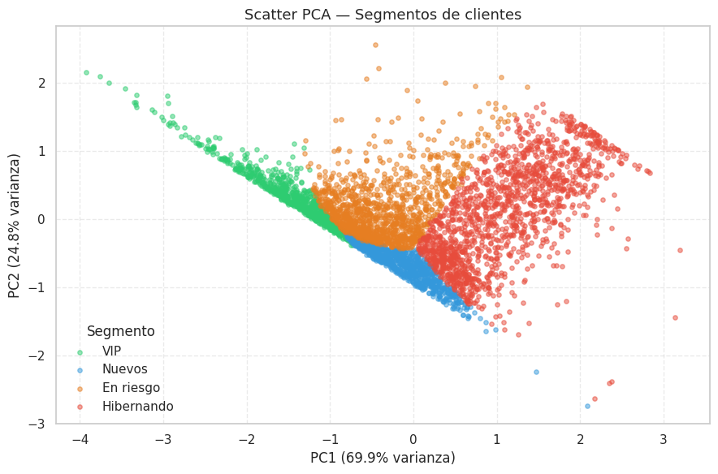
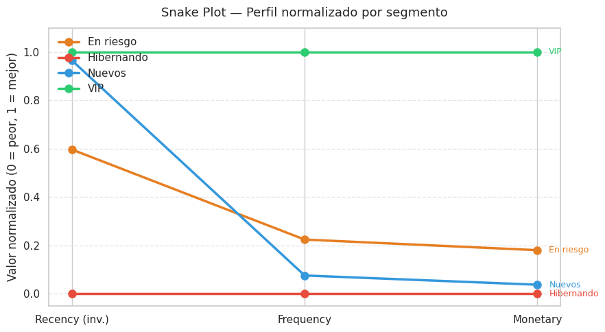
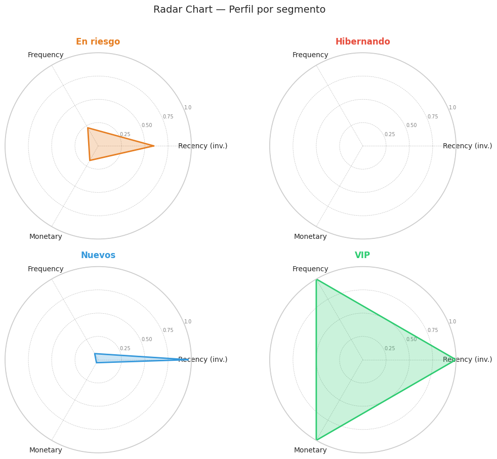

# 🛒 Customer Segmentation with RFM Clustering

An **unsupervised machine learning** project to segment customers from an online retailer based on their purchase behavior, using the RFM model and clustering algorithms.

---

## 📌 Objective

Identify groups of customers with similar behavior to design **personalized marketing strategies** per segment, maximizing retention, reactivation, and loyalty.

---

## 📊 Dataset

- **Name:** Online Retail Dataset
- **Source:** [UCI Machine Learning Repository](https://archive.ics.uci.edu/ml/datasets/Online+Retail)
- **Description:** Transactions from a UK-based online retailer between 2010 and 2011
- **Original records:** ~541,000 transactions

---

## 🔬 Methodology

| Stage | Description |
|---|---|
| 🧹 Cleaning | Removal of duplicates, nulls, and negative values |
| 📈 EDA | Distributions, outliers, and correlations |
| ⚙️ Feature Engineering | Building Recency, Frequency, and Monetary variables per customer |
| 🔧 Preprocessing | Log-transform + RobustScaler + PCA for visualization |
| 🤖 Modeling | Comparison of KMeans, GMM, and Agglomerative Clustering |
| 📏 Evaluation | Silhouette Score, Davies-Bouldin, and Calinski-Harabasz |
| 🏷️ Interpretation | Segment profiling and naming with business logic |
| 🎨 Visualization | Snake plot, Radar chart, and PCA Scatter plot |
| 💡 Recommendations | Actionable business strategies per segment |

---

## 🤖 Models evaluated

Three algorithms were compared with **k=4 clusters**:

- KMeans
- Agglomerative
- GMM 

✅ **Chosen model: KMeans** — best performance across all three metrics.

---

## 👥 Identified segments

| Segment | Profile | Strategy |
|---|---|---|
| 🟢 **VIP** | High frequency, high spend, recent purchase | Loyalty programs, exclusive access, volume discounts |
| 🔵 **New** | Recent purchase but low frequency and spend | Onboarding campaign, second-purchase coupon |
| 🟠 **At Risk** | Good history but haven't purchased in a while | Reactivation campaign, personalized offer |
| 🔴 **Hibernating** | Inactive, low historical value | Low-cost win-back or deprioritize |

---

## 🖼️ Visualizations

### Scatter PCA — Segment separation


### Snake Plot — Normalized profile per segment


### Radar Chart — Segment profile


---

## 📁 Repository structure

```
├── Proyecto_4.ipynb       # Main notebook
├── requirements.txt       # Dependencies
├── images/                # Exported visualizations
│   ├── scatter_pca.png
│   ├── snake_plot.png
│   └── radar_chart.png
└── README.md
```

---

## ⚙️ Installation

```bash
# Clone the repository
git clone https://github.com/your-username/proyecto-4-rfm.git
cd proyecto-4-rfm

# Install dependencies
pip install -r requirements.txt

# Open the notebook
jupyter notebook Proyecto_4.ipynb
```

---

## 📦 Dependencies

See [`requirements.txt`](requirements.txt) for the full list of libraries used.

---

# 📬 Contact

## GitHub

```bash
https://github.com/Ruben221b
```

## LinkedIn

```bash
https://www.linkedin.com/in/rubendcuello/
```